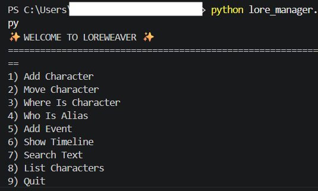

# ✨ LoreWeaver CLI

<p align="center">
  
</p>

<p align="center">
  <b>A small command-line tool for organizing fictional worlds, characters, aliases, and story timelines.</b>
</p>

<p align="center">
  Built by <b>Noamismach</b> as part of <b>BEEST by Hack Club</b>.
</p>

---

## 🌙 About LoreWeaver

**LoreWeaver CLI** is a Python project made for writers, worldbuilders, and creative people who want a simple way to keep track of their story universe.

Instead of keeping characters, locations, aliases, and events in random notes, LoreWeaver gives everything a clean place inside a terminal-based app.

It is simple, local, and focused on one goal:  
helping fictional worlds feel easier to manage.

---

## 🐝 Built for BEEST

<p align="center">
  
</p>

This project was created as part of **BEEST by Hack Club**, a program about building creative projects, learning by doing, and turning ideas into real working software.

For me, LoreWeaver was a way to combine programming with creativity — not just making a Python project, but building something that feels personal and useful.

---

## 🖥️ Demo

<p align="center">
  
</p>

LoreWeaver runs directly in the command line using a simple numbered menu.

---

## ✨ Features

- Create and store characters
- Save aliases, origins, and current locations
- Move characters between locations
- Reveal which character an alias belongs to
- Add timeline events
- Search through saved lore
- Store everything locally with JSON

---

## 💡 Why I Made This

I wanted to build something more personal than a basic practice project.

Stories can become complicated very quickly. Characters move, names change, events happen, and small details can become important later. LoreWeaver was inspired by that problem.

The idea was to create a small “memory system” for a fictional world — something simple, but still useful for storytelling, roleplay, fantasy writing, or any creative universe.

---

## 🛠️ Technologies Used

- Python 3
- JSON
- Command Line Interface
- Built-in Python modules:
  - `json`
  - `os`
  - `sys`

---

## ▶️ How to Run

Clone the repository:

```bash
git clone https://github.com/Noamismach/LoreWeaver.git
````

Enter the project folder:

```bash
cd LoreWeaver
```

Run the app:

```bash
python lore_manager.py
```

or:

```bash
python3 lore_manager.py
```

Open the help menu:

```bash
python lore_manager.py --help
```

---

## 📁 Project Structure

```txt
LoreWeaver/
│
├── lore_manager.py
├── lore_data.json
├── README.md
└── img/
    ├── cmd.png
    ├── hero.webp
    └── logo.png
```

---

## 📌 What I Learned

While building LoreWeaver, I practiced:

* Structuring a Python project
* Working with functions
* Reading and writing JSON data
* Handling user input
* Creating a command-line menu
* Making a project with a clear creative purpose

---

## 🔮 Future Ideas

Some features I may add later:

* Edit existing characters
* Delete characters or events
* Add better location management
* Track relationships between characters
* Export the timeline
* Create a visual interface

---

## 👨‍💻 Author

Created by **Noamismach**

Built as part of **BEEST by Hack Club**.
